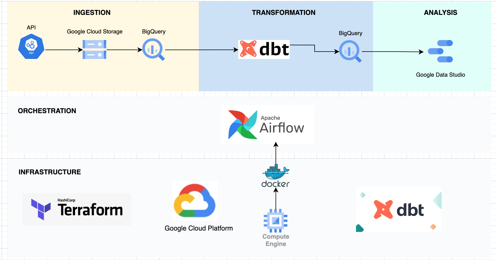
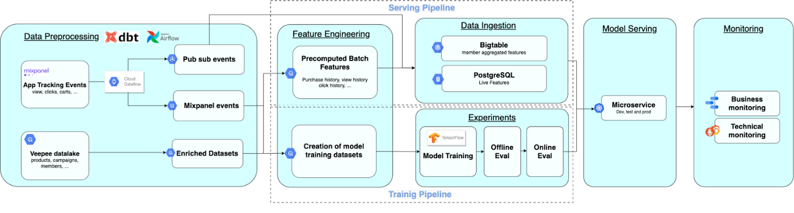

# football-stats-pipeline
- [EPL football clubs statistics data pipeline](#football-stats-pipeline)
    - [Problem statement](#problem-statement)
    - [Goal](#main-goal)
    - [Project structure](#structure)

## Problem statement
For passionate football fans like myself, football statistics are very important and I usually find myself digging into it a lot to get more insights about my football club. I find it kind of stressful sometimes looking for answers to some questions about my football club. This is because I don't have a standard website to show me the statistics I need. I find myslef juggling different sites just to get the information I need. I came across a particular website which I find kind of interesting as it contains lots of data about various leagues, clubs, players and seasons and this data can be gotten from different API endpoints. So I decided to work with this data to develop a dashboard showing various statistics for various clubs in England. Examples of data gotten from the API ednpoints:
    - Team information such as founding year, stadium, city
    - Team stats about matches, goals, and bookings
    - Player stats such as goals, injuries e.t.c 

## Main goal
Develop an ETLT data pipeline and dashboard for viewing statistics of clubs in England:
- Call the needed API endpoints
- Create a pipeline for processing the data gotten from the API and converting it to format that can be saved to a data-lake
- Create a pipeline for moving the data from the data lake to a data warehouse
- Transform the data in the warehouse: prepare it for use by the BI tool
- Create a dashboard

## Structure
### Technologies
- Cloud provider: GCP
- Infrastructure as code (IaC): Terraform
- Workflow orchestration: Apache Airflow
- Data Lake: GCS
- Data Warehouse: BigQuery
- Transformations: dbt cloud
- Dashboard: Google Data Studio
### ARCHITECTURE

    

###### Infrastructute as code:
use Terraform to create a GCS bucket and BigQuery dataset:
- football_data_raw GCS bucket to store csv files 
- football_dataset for the ingestion into BigQuery
- dbt_development for dbt development environment
- production for dbt production environment

###### Orchestration:
Airflow was used to orchestrate the data extraction from the api, ingestion of data and transformation using dbt cloud.

###### Data ingestion:
Football Data is gotten by making api requests to api-football.com. The response gotten is then transformef to a sutiable format and loaded into GCS buckets before loading to bigquery. All of these are managed with Apache Airflow with various DAG files:
- DAG team_info_dag: To ingest general information about Premier league clubs. This DAG is only scheduled to be triggered once every year as these info do not change frequently
- Dag statistics_dag: To ingets latest data about english premier league clubs on the games played, goals scored and conceded, and bookings. This DAG is scheduled to be triggered every week as the english premier league matches happens every weekend. 

##### Transformations with DBT
DBT cloud to perform joins on BQ, run seeds and tests. CI/CD pipeline was set up to prevent merging branches with failed tests.

- models: All the models created in this job allowed the extraction of the latest records from the bigquery tables. 
- tests: Tests were written to ensure we don't have null values in non-null columns, only accepted values are passsed in to some columns, and the relationships between tables are correct.
- job: This was generated to create the datasets in production. DBT build command was configured to run for this job as this enables all the seeds to be run, as well as the tests before running the actual transformation commands.

#### Dashboard
Connected Google Data Studio to the BQ dataset. The dashboard contains statistics for different premier league clubs. It allows to filter by club and view the performance of the club in the current season.

Results 
Dashbord can be viewed [here](https://datastudio.google.com/s/nwwjr72VXuo).

**Dashboard**

    

